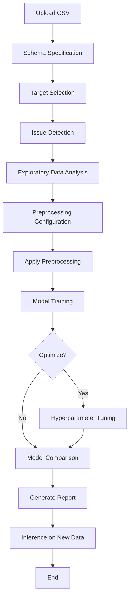

# AutoML System

> A comprehensive, modular AutoML system built with Streamlit and scikit-learn for automating the complete machine learning lifecycle while maintaining user control.

[](https://www.python.org/downloads/)
[](https://streamlit.io)
[](https://scikit-learn.org)

---

## 📋 Table of Contents

- [Overview](#-overview)
- [Features](#-features)
- [Tech Stack](#️-tech-stack)
- [Installation](#-installation)
- [Usage](#-usage)
- [Project Structure](#-project-structure)
- [Architecture](#️-architecture)
- [Workflow](#-workflow)
- [Modules Documentation](#-modules-documentation)
- [Testing](#-testing)
- [Security](#-security)
- [Contributing](#-contributing)
- [License](#-license)
- [Acknowledgments](#-acknowledgments)

---

## 🎯 Overview

This AutoML system is an academic project (CS-245, NUST) that demonstrates production-grade architecture for automating repetitive machine learning workflows. It provides an end-to-end pipeline from data upload through preprocessing, model training, hyperparameter optimization, comparison, and report generation.

The system emphasizes:

- **Modularity**: Clear separation of concerns with well-defined module responsibilities
- **Extensibility**: Easy addition of new models, preprocessing techniques, or optimizers
- **Maintainability**: Clean code structure with comprehensive documentation
- **User Control**: Automation with human-in-the-loop for critical decisions
- **Robustness**: Comprehensive error handling and input validation

### Key Capabilities

1. **Guided Data Upload**: CSV dataset handling with schema specification and target selection
2. **Quality Issue Detection**: Automatic identification of data quality problems
3. **Exploratory Data Analysis**: Automated visualizations and statistical summaries
4. **Preprocessing Pipeline**: Modular data transformation with imputation, encoding, and scaling
5. **Multi-Model Training**: Support for multiple classical ML algorithms
6. **Hyperparameter Optimization**: Grid search and random search capabilities
7. **Model Comparison**: Side-by-side performance evaluation and ranking
8. **Report Generation**: Automated documentation of analysis and results
9. **Inference**: Predictions on new data using trained models

---

## ✨ Features

### Data Management

- ✅ **CSV Upload**: Robust handling of CSV files with validation
- ✅ **Schema Specification**: Define column types (numeric/categorical)
- ✅ **Target Selection**: Choose target variable for supervised learning
- ✅ **Metadata Extraction**: Automatic dataset information gathering
- ✅ **Corrupted File Handling**: Graceful error handling without crashes

### Data Analysis

- 📊 **Automated EDA**: Comprehensive exploratory data analysis
- 📈 **Distribution Analysis**: Visualize feature distributions
- 🔗 **Correlation Analysis**: Identify feature relationships
- 🔍 **Missing Values**: Detect and analyze missing data patterns
- 📉 **Outlier Detection**: Identify anomalous data points

### Issue Detection

- ⚠️ **Class Imbalance**: Detect imbalanced target distributions
- 🔤 **Datatype Mismatches**: Identify inconsistent data types
- 🎯 **High Cardinality**: Flag categorical features with too many unique values
- 📋 **Data Quality Warnings**: Comprehensive quality assessment

### Preprocessing

- 🔧 **Missing Value Imputation**: Multiple imputation strategies
- 🏷️ **Categorical Encoding**: One-hot and label encoding
- 📏 **Feature Scaling**: Standardization and normalization
- 🎯 **Outlier Handling**: Removal or transformation options
- 🔄 **Pipeline Management**: Serializable preprocessing pipelines

### Machine Learning

- 🤖 **Multiple Models**: Logistic Regression, KNN, SVM, Decision Tree, Naive Bayes
- 🎛️ **Hyperparameter Tuning**: Grid search and random search optimization
- 📊 **Performance Metrics**: Comprehensive evaluation metrics
- 🏆 **Model Ranking**: Automatic ranking by performance
- 💾 **Model Persistence**: Save and load trained models

### Reporting & Inference

- 📄 **Report Generation**: Markdown/HTML/PDF reports with visualizations
- 🔮 **Inference Interface**: Upload new data for predictions
- 📤 **Export Results**: Download predictions and reports

---

## 🛠️ Tech Stack

| Component           | Technology                  | Purpose                                   |
| ------------------- | --------------------------- | ----------------------------------------- |
| **Frontend**        | Streamlit                   | Interactive web interface                 |
| **ML Framework**    | scikit-learn                | Model training and pipelines              |
| **Data Processing** | pandas, numpy               | Data manipulation and numerical computing |
| **Visualization**   | Plotly, seaborn, matplotlib | Interactive charts and plots              |
| **Reports**         | Markdown, ReportLab         | Document generation                       |
| **Serialization**   | pickle                      | Model and pipeline persistence            |
| **Language**        | Python 3.11+                | Core implementation                       |

---

## 🚀 Installation

### Prerequisites

- Python 3.11 or higher
- pip package manager
- Virtual environment (recommended)

### Setup Instructions

1. **Clone the repository**

   ```bash
   git clone <repository-url>
   cd Project
   ```

2. **Create a virtual environment**

   ```bash
   # Using venv
   python -m venv venv

   # Activate on macOS/Linux
   source venv/bin/activate

   # Activate on Windows
   venv\Scripts\activate
   ```

3. **Install dependencies**

   ```bash
   pip install -r requirements.txt
   ```

4. **Verify installation**
   ```bash
   python -c "import streamlit; import sklearn; print('Installation successful!')"
   ```

---

## 💻 Usage

### Starting the Application

```bash
# From project root directory
streamlit run main.py

# Alternative (if in different directory)
python -m streamlit run /path/to/Project/main.py
```

The application will start on `http://localhost:8501`

### Basic Workflow

#### 1. **Home Page**

- Review project overview
- Understand workflow steps
- View team contributions

#### 2. **Upload Dataset**

- Upload CSV file (up to 10,000 rows recommended)
- Specify column types (numeric/categorical)
- Select target variable
- Review dataset preview

#### 3. **Issue Detection**

- Automatic scan for data quality issues
- Review warnings about:
  - Missing values
  - Class imbalance
  - High cardinality features
  - Datatype mismatches
- Understand impact on model performance

#### 4. **Exploratory Data Analysis (EDA)**

- View automated visualizations:
  - Feature distributions (histograms, box plots)
  - Correlation matrices
  - Missing value patterns
  - Outlier detection plots
- Gain insights into data characteristics

#### 5. **Preprocessing**

- Configure preprocessing steps:
  - **Imputation**: Mean, median, mode, or constant
  - **Encoding**: One-hot or label encoding
  - **Scaling**: StandardScaler or MinMaxScaler
  - **Outlier Handling**: Remove or keep
- Preview transformed data
- Save preprocessing pipeline

#### 6. **Model Training**

- Select models to train:
  - Logistic Regression
  - K-Nearest Neighbors (KNN)
  - Support Vector Machine (SVM)
  - Decision Tree
  - Naive Bayes
- Train selected models on preprocessed data
- View training progress and results

#### 7. **Hyperparameter Optimization**

- Choose optimization strategy:
  - Grid Search (exhaustive)
  - Random Search (sampling-based)
- Configure parameter grids for each model
- Run optimization and view best parameters
- Compare optimized vs. baseline performance

#### 8. **Model Comparison**

- Side-by-side comparison of all trained models
- Performance metrics:
  - Accuracy
  - Precision, Recall, F1-Score
  - Confusion Matrix
  - ROC Curve (for binary classification)
- Automatic ranking by performance

#### 9. **Report Generation**

- Generate comprehensive analysis report including:
  - Dataset summary
  - EDA visualizations
  - Issue detection findings
  - Preprocessing steps
  - Model performance comparison
  - Best model recommendations
- Download as Markdown/HTML/PDF

#### 10. **Inference**

- Upload new data (same schema as training data)
- Select trained model for predictions
- Generate predictions
- Download results as CSV

---

## 📁 Project Structure

```
Project/
│
├── main.py                          # Application entry point
├── requirements.txt                 # Python dependencies
├── README.md                        # This file
│
├── app/                             # Application orchestration
│   ├── __init__.py
│   ├── config.py                    # Global configurations and constants
│   └── state.py                     # Session state management
│
├── core/                            # Core data handling
│   ├── __init__.py
│   ├── data_loader.py              # CSV loading, validation, and parsing
│   └── metadata.py                 # Dataset information extraction
│
├── eda/                            # Exploratory Data Analysis
│   ├── __init__.py
│   ├── eda_runner.py               # EDA orchestration
│   ├── missing_values.py           # Missing data analysis
│   ├── outliers.py                 # Outlier detection
│   ├── distributions.py            # Distribution visualization
│   └── correlations.py             # Correlation analysis
│
├── issues/                         # Data quality issue detection
│   ├── __init__.py
│   ├── imbalance.py                # Class imbalance detection
│   ├── datatype_mismatch.py        # Data type inconsistency checks
│   ├── high_cardinality.py         # High cardinality detection
│   └── thresholds.py               # Issue detection thresholds
│
├── preprocessing/                  # Data preprocessing
│   ├── __init__.py
│   ├── imputers.py                 # Missing value imputation strategies
│   ├── encoders.py                 # Categorical encoding methods
│   ├── scalers.py                  # Feature scaling transformers
│   └── pipeline.py                 # Preprocessing pipeline builder
│
├── models/                         # Machine learning models
│   ├── __init__.py
│   ├── base_model.py               # Abstract base class for models
│   ├── logistic_regression.py      # Logistic Regression implementation
│   ├── knn.py                      # K-Nearest Neighbors implementation
│   ├── svm.py                      # Support Vector Machine implementation
│   ├── decision_tree.py            # Decision Tree implementation
│   └── naive_bayes.py              # Naive Bayes implementation
│
├── optimization/                   # Hyperparameter optimization
│   ├── __init__.py
│   ├── grid_search.py              # Grid search implementation
│   └── random_search.py            # Random search implementation
│
├── evaluation/                     # Model evaluation
│   ├── __init__.py
│   ├── metrics.py                  # Performance metrics calculation
│   ├── comparison.py               # Model comparison logic
│   └── ranking.py                  # Model ranking algorithms
│
├── reports/                        # Report generation
│   ├── __init__.py
│   ├── report_builder.py           # Report generation logic
│   └── templates/                  # Report templates
│       └── __init__.py
│
├── ui/                             # Streamlit UI components
│   ├── __init__.py
│   ├── upload.py                   # Upload interface
│   ├── eda_view.py                 # EDA visualization page
│   ├── preprocessing_view.py       # Preprocessing configuration page
│   ├── training_view.py            # Model training page
│   ├── optimization_view.py        # Hyperparameter optimization page
│   ├── comparison_view.py          # Model comparison page
│   ├── report_view.py              # Report generation page
│   └── inference_view.py           # Inference interface
│
├── utils/                          # Utility modules
│   ├── __init__.py
│   ├── validators.py               # Input validation functions
│   ├── logger.py                   # Logging configuration
│   ├── timers.py                   # Performance timing utilities
│   └── security.py                 # Security utilities
│
└── tests/                          # Test suite
    ├── __init__.py
    ├── test_data_loader.py         # Data loader tests
    └── test_preprocessing.py       # Preprocessing tests
```

---

## 🏗️ Architecture

### Design Principles

1. **Separation of Concerns**: Each module has a single, well-defined responsibility
2. **Abstract Base Classes**: Consistent interface for extensible components
3. **Dependency Injection**: Loose coupling between components
4. **Configuration Over Code**: Externalized settings and parameters
5. **Fail-Safe Design**: Comprehensive error handling and graceful degradation
6. **DRY Principle**: No duplication of logic across modules

### Layer Architecture

```
┌─────────────────────────────────────────────────────────────┐
│                    UI Layer (Streamlit)                      │
│              upload, eda_view, training_view, etc.           │
└─────────────────────────────────────────────────────────────┘
                              ↕
┌─────────────────────────────────────────────────────────────┐
│               Application Layer (app/)                       │
│           State Management & Configuration                   │
└─────────────────────────────────────────────────────────────┘
                              ↕
┌─────────────────────────────────────────────────────────────┐
│               Business Logic Layers                          │
│  ┌────────────┐ ┌────────────┐ ┌────────────┐             │
│  │    EDA     │ │  Issues    │ │Preprocessing│             │
│  └────────────┘ └────────────┘ └────────────┘             │
│  ┌────────────┐ ┌────────────┐ ┌────────────┐             │
│  │  Models    │ │Optimization│ │ Evaluation  │             │
│  └────────────┘ └────────────┘ └────────────┘             │
│  ┌────────────┐                                             │
│  │  Reports   │                                             │
│  └────────────┘                                             │
└─────────────────────────────────────────────────────────────┘
                              ↕
┌─────────────────────────────────────────────────────────────┐
│                 Data Layer (core/)                           │
│            Data Loading & Metadata Extraction                │
└─────────────────────────────────────────────────────────────┘
                              ↕
┌─────────────────────────────────────────────────────────────┐
│              Utility Layer (utils/)                          │
│       Logging, Validation, Security, Timing                  │
└─────────────────────────────────────────────────────────────┘
```

### Key Design Patterns

- **Strategy Pattern**: Multiple algorithms for imputation, encoding, scaling
- **Factory Pattern**: Model creation and instantiation
- **Template Method**: Base model class with concrete implementations
- **Builder Pattern**: Report generation with configurable sections
- **Observer Pattern**: State management across UI components

---

## 🔄 Workflow



---

## 📚 Modules Documentation

### Core Modules

#### `core/data_loader.py`

- **Purpose**: Load and validate CSV datasets
- **Key Functions**:
  - `load_csv()`: Read CSV with error handling
  - `validate_schema()`: Verify column types
  - `detect_delimiter()`: Auto-detect CSV delimiter
- **Error Handling**: Catches encoding issues, malformed files, size limits

#### `core/metadata.py`

- **Purpose**: Extract dataset information
- **Key Functions**:
  - `get_dataset_info()`: Return shape, types, memory usage
  - `get_column_stats()`: Statistical summaries per column
  - `preview_data()`: Return head/tail of dataset

### EDA Modules

#### `eda/eda_runner.py`

- **Purpose**: Orchestrate all EDA analyses
- **Key Functions**:
  - `run_eda()`: Execute complete EDA pipeline
  - `generate_visualizations()`: Create all plots
  - `summarize_insights()`: Extract key findings

#### `eda/distributions.py`

- **Purpose**: Analyze and visualize feature distributions
- **Visualizations**: Histograms, box plots, KDE plots

#### `eda/correlations.py`

- **Purpose**: Compute and visualize feature correlations
- **Visualizations**: Heatmaps, scatter plots

### Issue Detection Modules

#### `issues/imbalance.py`

- **Purpose**: Detect class imbalance in target variable
- **Threshold**: Flags if minority class < 20% of majority

#### `issues/high_cardinality.py`

- **Purpose**: Identify categorical features with too many unique values
- **Threshold**: Flags if unique values > 50% of total rows

### Preprocessing Modules

#### `preprocessing/pipeline.py`

- **Purpose**: Build and execute preprocessing pipeline
- **Key Functions**:
  - `build_pipeline()`: Construct sklearn pipeline
  - `fit_transform()`: Fit and transform training data
  - `transform()`: Transform test/inference data
  - `save_pipeline()`: Serialize pipeline for later use

#### `preprocessing/imputers.py`

- **Strategies**: Mean, median, mode, constant value
- **Supports**: Numeric and categorical features

#### `preprocessing/encoders.py`

- **Methods**: One-hot encoding, label encoding
- **Handles**: Unseen categories during inference

#### `preprocessing/scalers.py`

- **Methods**: StandardScaler (z-score), MinMaxScaler (0-1)
- **Application**: Numeric features only

### Model Modules

#### `models/base_model.py`

- **Purpose**: Abstract base class for all models
- **Interface**:
  - `train()`: Fit model on training data
  - `predict()`: Generate predictions
  - `evaluate()`: Compute performance metrics
  - `get_params()`: Return hyperparameters
  - `set_params()`: Update hyperparameters

#### Individual Model Classes

Each model extends `BaseModel` with specific implementations:

- `LogisticRegressionModel`: Linear classification
- `KNNModel`: Instance-based learning
- `SVMModel`: Support vector classification
- `DecisionTreeModel`: Tree-based classification
- `NaiveBayesModel`: Probabilistic classification

### Optimization Modules

#### `optimization/grid_search.py`

- **Purpose**: Exhaustive search over parameter grid
- **Key Functions**:
  - `define_grid()`: Create parameter grid for each model
  - `search()`: Execute grid search with cross-validation
  - `get_best_params()`: Return optimal parameters

#### `optimization/random_search.py`

- **Purpose**: Random sampling from parameter distributions
- **Advantage**: Faster than grid search for large parameter spaces

### Evaluation Modules

#### `evaluation/metrics.py`

- **Classification Metrics**: Accuracy, Precision, Recall, F1-Score
- **Confusion Matrix**: True/False Positives/Negatives
- **ROC/AUC**: For binary classification

#### `evaluation/comparison.py`

- **Purpose**: Compare multiple models side-by-side
- **Output**: Comparison table with all metrics

#### `evaluation/ranking.py`

- **Purpose**: Rank models by performance
- **Ranking Strategy**: Configurable primary metric (default: accuracy)

### Report Modules

#### `reports/report_builder.py`

- **Purpose**: Generate comprehensive analysis reports
- **Sections**:
  - Dataset overview
  - EDA findings
  - Issue detection results
  - Preprocessing steps
  - Model performance comparison
  - Recommendations
- **Formats**: Markdown, HTML, PDF

### UI Modules

#### `ui/upload.py`

- **Features**: File upload, schema specification, target selection
- **Validation**: File type, size, column existence

#### `ui/eda_view.py`

- **Features**: Interactive EDA visualizations
- **Interactivity**: Filter by feature, customize plot parameters

#### `ui/training_view.py`

- **Features**: Model selection, training progress, results display

#### `ui/comparison_view.py`

- **Features**: Side-by-side model comparison, metric visualization

#### `ui/inference_view.py`

- **Features**: Upload new data, select model, generate predictions

### Utility Modules

#### `utils/validators.py`

- **Purpose**: Input validation and sanitization
- **Validations**: File format, column types, value ranges

#### `utils/logger.py`

- **Purpose**: Centralized logging configuration
- **Levels**: DEBUG, INFO, WARNING, ERROR, CRITICAL

#### `utils/security.py`

- **Purpose**: Security utilities
- **Features**: Input sanitization, file type verification

#### `utils/timers.py`

- **Purpose**: Performance timing and profiling
- **Usage**: Decorator for timing function execution

---

## 🧪 Testing

### Running Tests

```bash
# Run all tests
pytest tests/

# Run specific test file
pytest tests/test_data_loader.py

# Run with coverage
pytest --cov=. tests/

# Run with verbose output
pytest -v tests/
```

### Test Structure

- **Unit Tests**: Test individual functions and classes
- **Integration Tests**: Test module interactions
- **Test Coverage**: Aim for >80% code coverage

### Example Test

```python
# tests/test_data_loader.py
import pytest
from core.data_loader import load_csv

def test_load_csv_valid_file():
    df = load_csv("path/to/valid.csv")
    assert df is not None
    assert len(df) > 0

def test_load_csv_invalid_file():
    with pytest.raises(ValueError):
        load_csv("path/to/invalid.csv")
```

---

## 🔒 Security

### Security Measures

1. **Input Validation**

   - File type restrictions (CSV only)
   - File size limits (prevent DoS)
   - Column name sanitization
   - Data type validation

2. **File Handling**

   - Secure temporary file storage
   - Automatic cleanup of uploaded files
   - No arbitrary file execution
   - Path traversal prevention

3. **Data Privacy**

   - No data stored on server after session
   - Session isolation
   - No logging of sensitive data

4. **Code Execution**
   - No eval() or exec() usage
   - No arbitrary code execution
   - Sandboxed model training

### Best Practices

- Always use virtual environments
- Keep dependencies updated
- Review uploaded files
- Monitor resource usage
- Implement rate limiting (if deploying)

---

## 🤝 Contributing

### Contribution Guidelines

This is an academic project, but contributions are welcome for educational purposes.

1. **Fork the repository**
2. **Create a feature branch**
   ```bash
   git checkout -b feature/your-feature-name
   ```
3. **Follow coding standards**
   - PEP 8 style guide
   - Type hints where appropriate
   - Comprehensive docstrings
   - Unit tests for new features
4. **Commit your changes**
   ```bash
   git commit -m "Add: brief description of changes"
   ```
5. **Push to your fork**
   ```bash
   git push origin feature/your-feature-name
   ```
6. **Create a Pull Request**

### Code Standards

- **Python Version**: 3.11+
- **Style Guide**: PEP 8
- **Docstring Format**: Google-style docstrings
- **Type Hints**: Use where applicable
- **Testing**: Write tests for new features

### Adding New Models

To add a new model:

1. Create a new file in `models/` (e.g., `random_forest.py`)
2. Extend `BaseModel` class
3. Implement required methods: `train()`, `predict()`, `evaluate()`
4. Add model to `app/config.py` SUPPORTED_MODELS list
5. Add default hyperparameters to optimization modules
6. Write unit tests

Example:

```python
# models/random_forest.py
from models.base_model import BaseModel
from sklearn.ensemble import RandomForestClassifier

class RandomForestModel(BaseModel):
    def __init__(self, **kwargs):
        super().__init__()
        self.model = RandomForestClassifier(**kwargs)

    def train(self, X, y):
        self.model.fit(X, y)

    def predict(self, X):
        return self.model.predict(X)

    def evaluate(self, X, y):
        # Implementation
        pass
```

---

## 📄 License

This project is created for academic purposes as part of CS-245 coursework at National University of Sciences & Technology (NUST).

**License Type**: [Specify your license - MIT, Apache 2.0, etc.]

---

## 🙏 Acknowledgments

### Course Information

- **Course**: CS-245 - Software Engineering
- **Institution**: National University of Sciences & Technology (NUST)
- **Academic Year**: 2024-2025

### Technologies

Special thanks to the open-source community and the developers of:

- [Streamlit](https://streamlit.io/) - Interactive web app framework
- [scikit-learn](https://scikit-learn.org/) - Machine learning library
- [pandas](https://pandas.pydata.org/) - Data manipulation library
- [Plotly](https://plotly.com/) - Interactive visualization library

### Resources

- scikit-learn documentation for ML best practices
- Streamlit documentation for UI development
- Python packaging guidelines

---

## 📞 Support & Contact

### Getting Help

- **Issues**: [Open an issue](link-to-issues) on GitHub
- **Documentation**: Refer to this README and inline code documentation
- **Questions**: Contact the maintainers

### Maintainers

[Add maintainer information]

- **Name**: [Your Name]
- **Email**: [your.email@example.com]
- **GitHub**: [@yourusername](https://github.com/yourusername)

---

## 📈 Future Enhancements

Potential improvements for future versions:

- [ ] Support for regression tasks
- [ ] Additional ML models (XGBoost, Random Forest, Neural Networks)
- [ ] Feature engineering automation
- [ ] Time series analysis
- [ ] Multi-class classification improvements
- [ ] Model explainability (SHAP, LIME)
- [ ] API endpoint for programmatic access
- [ ] Database integration for data persistence
- [ ] User authentication and project management
- [ ] Collaborative features
- [ ] Cloud deployment guide

---

## 📊 Project Statistics

- **Total Modules**: 12
- **Total Files**: 40+
- **Lines of Code**: ~5000+
- **Supported Models**: 5
- **Preprocessing Options**: 10+
- **Target Dataset Size**: Up to 10,000 rows

---

## 🎓 Learning Outcomes

This project demonstrates:

- Software engineering principles (modularity, extensibility)
- Machine learning pipeline development
- Full-stack development (backend logic + frontend UI)
- Data preprocessing best practices
- Model evaluation and comparison
- Error handling and input validation
- Code documentation and project structure
- Version control and collaboration

---

**Built with ❤️ for CS-245 at NUST**

---

_Last Updated: December 26, 2025_
